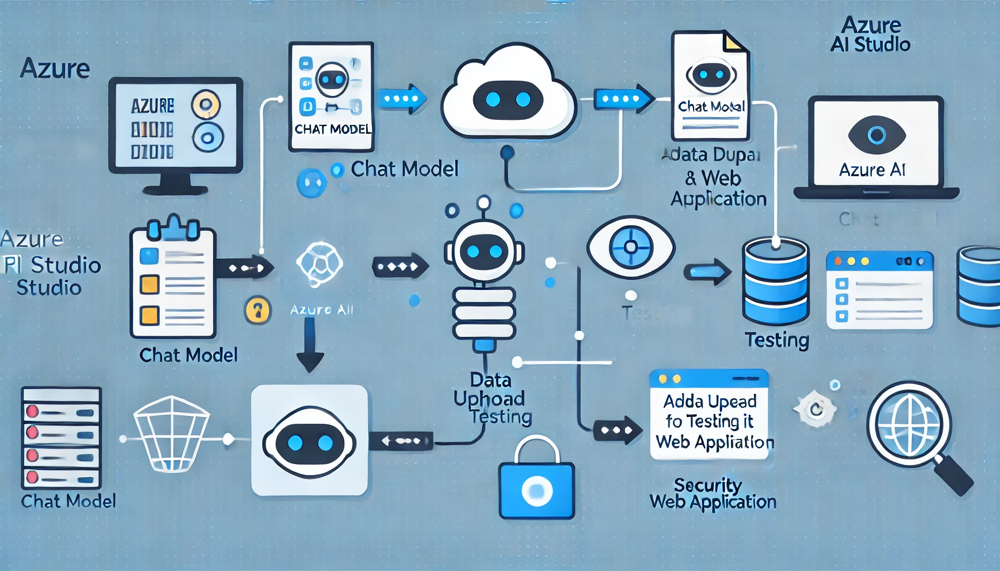

# Challenge 2: Deploy an GenAI Enterprise Chat web app

 [< Previous Challenge](./Challenge1-Foundamentas.md) - **[Home](../README.md)** - [Next Challenge >](./Challenge3-Foundamentals.md)

## Introduction
After setting up a hub and a project in Azure AI Studio, the next essential step is to deploy and thoroughly test the model with and without your data. Deploying the model makes it accessible for various applications, while testing ensures its performance meets the desired standards before integrating it into a production environment such as a web application.

## Description
As you progress in building your chat model, it's essential to ensure that it not only functions correctly but also provides accurate responses based on your specific data. After successfully deploying your chat model in Azure AI Studio, you realize that adding your own data can significantly enhance its capabilities. To verify this, you need to integrate your data into the model, test its responses, and ensure it is ready for broader deployment.

Your tasks involve uploading your product data to the deployed chat model, testing how well the model handles queries using this data, and then deploying the model as a web application. Finally, you will secure the web app by configuring authentication, ensuring that only authorized users within your Azure tenant can access it.

By completing this challenge, you will validate that your chat model is not only functional but also tailored to meet the specific needs of your application, ready to be deployed and used in a real-world environment.

*Generated by DALLE

## Success Criteria

- Confirm that your chat completions model is deployed and functional without custom data.
- Verify that your data has been successfully added to the deployed model in Azure AI Studio.
- Ensure the model accurately responds to queries using your data.
- Validate that the chat model is deployed as a web application in Azure.
- Confirm that authentication is configured, restricting web app access to users within your Azure tenant.
- Verify that the web app uses your data to generate responses.

## Resources
- [Retail Data](https://github.com/Azure-Samples/rag-data-openai-python-promptflow/tree/main/tutorial/data)
- [Deploy an Enterprise Chat web app](https://learn.microsoft.com/en-us/azure/ai-studio/tutorials/deploy-chat-web-app)

