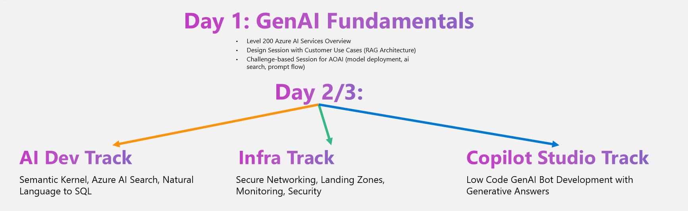

# AI-Foundations-Workshops

## Overview

Welcome to the SE GPS Workshop on Azure OpenAI and Copilot Studio solution development! This workshop is designed to provide you with hands-on experience in leveraging Azure AI services, specifically focusing on Generative AI (GenAI) capabilities. Across two days, you'll engage in presentations, whiteboarding sessions, and practical development tracks to build real-world solutions using Azure OpenAI and Copilot Studio.

## 📅 Workshop Agenda

### 📝 GenAI Fundamentals

- **Azure AI Services Overview (2 hours)**
- **Design Session - Customer Use Case - Document Intelligence (2 hours)**
- **AI Fundamentals Challenges (3 hours)**
    - Challenge 01: [Create a project and use the chat playground in Azure AI Studio](https://learn.microsoft.com/en-us/azure/ai-studio/quickstarts/get-started-playground)
    - Challenge 02: [Deploy an Enterprise Chat web app](https://learn.microsoft.com/en-us/azure/ai-studio/tutorials/deploy-chat-web-app)
    - Challenge 03: [Create .NET core application and build your first intelligent app](https://learn.microsoft.com/en-us/azure/ai-services/openai/use-your-data-quickstart?pivots=programming-language-csharp&tabs=command-line%2Cpython-new#create-a-new-net-core-application)

### 📝 Deep Dive Technical Tracks

- **[AI Developer Track]("https://github.com/MS-GPS-Hackathons/AI-Developer-Building-Intelligent-Apps-Hackathon?tab=readme-ov-file")** (2 Days Delivery)
  - **Objective:** Unlock the potential of Semantic Kernel in developing intelligent applications. Whether you prefer C# or Python, this session will provide you with the knowledge to incorporate Semantic Kernel into your applications, facilitating seamless integration of AI prompts with conventional programming languages for smarter, more responsive applications, Natural Language to SQL, Work with different Vector DB to store your indexed data

  
- **[Infrastracture]("https://github.com/jonathan-vella/architecting-for-success/tree/main/402-ALZ-for-OpenAI")** (2 Days Delivery)
  - **Objective:** Deploy the infrastructure and Landing Zones for your AOAI solution

- **[Copilot Studio Development Track](/Day2-CopilotStudio/Overview.md)** (1 Day Delivery)
  - **Objective:** Build and deploy a bot using Copilot Studio based on the Customer Use Case of the 1st day.

## 📚 Resources

- **Pre-requisites:** Ensure you have the necessary Azure subscriptions and development environments set up before attending the workshop.
- **Reference Materials:** Links to documentation, tutorials, and example code will be provided in the challenges of the workshop.
- **Support:** Throughout the workshop, coaches will be available to assist with technical challenges and answer questions.

## 🎯 Objectives

By the end of this workshop, participants will:

1. Gain a comprehensive understanding of Azure AI services, with a focus on Generative AI.
2. Design a solution architecture for a customer use case using Azure OpenAI and Copilot Studio.
3. Develop and deploy a functional solution leveraging Azure OpenAI and Copilot Studio tools.

