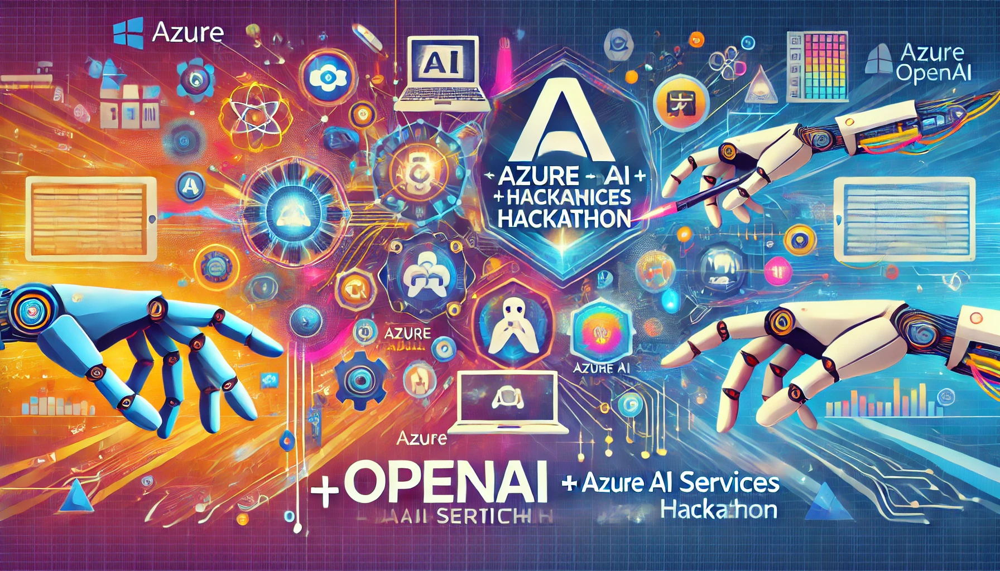

# AI-Foundations-Workshop
SE GPS Workshop on Azure OpenAI and Copilot Studio Solution Development based on Microsoft's best practices

## Overview

Welcome to the SE GPS Workshop on Azure OpenAI and Copilot Studio solution development! This workshop is designed to provide you with hands-on experience in leveraging Azure AI services, specifically focusing on Generative AI (GenAI) capabilities. Across two days, you'll engage in presentations, whiteboarding sessions, and practical development tracks to build real-world solutions using Azure OpenAI and Copilot Studio.

## 📅 Workshop Agenda

### 📝 Day 1: Introduction & Whiteboarding Session

**Morning Session: Azure AI Services Overview**

- **Objective:** Understand the landscape of Azure AI services with a focus on Generative AI.
- **Content:**
  - Overview of Azure AI services
  - Deep dive into Generative AI capabilities
  - Use cases and real-world examples
  - Best practices and strategies for implementing AI solutions

**Afternoon Session: Whiteboarding Customer Use Case**

- **Objective:** Collaboratively design a solution architecture for a customer use case.
- **Content:**
  - Whiteboarding session to outline technical requirements
  - Focus on Azure OpenAI and Copilot Studio Bot creation
  - Define solution architecture and key components
  - Prepare for Day 2 hands-on implementation

### 👨‍💻👩‍💻 Day 2: Hands-on Solution Development

**Morning & Afternoon Sessions: Parallel Tracks**

- **Track 1: Azure OpenAI Development**
  - **Objective:** Build and deploy a solution using Azure OpenAI.
  - **Content:**
    - Set up Azure OpenAI services
    - Choose the best data indexing and AI model for the bot
    - Integrate the model with customer-specific requirements
    - Test and validate the solution

- **Track 2: Copilot Studio Development**
  - **Objective:** Build and deploy a bot using Copilot Studio.
  - **Content:**
    - Set up Copilot Studio environment
    - Design and develop the bot
    - Integrate with Azure services
    - Test and validate the solution

## 📚 Resources

- **Pre-requisites:** Ensure you have the necessary Azure subscriptions and development environments set up before attending the workshop.
- **Reference Materials:** Links to documentation, tutorials, and example code will be provided in the challenges of the workshop.
- **Support:** Throughout the workshop, coaches will be available to assist with technical challenges and answer questions.

## 🎯 Objectives

By the end of this workshop, participants will:

1. Gain a comprehensive understanding of Azure AI services, with a focus on Generative AI.
2. Design a solution architecture for a customer use case using Azure OpenAI and Copilot Studio.
3. Develop and deploy a functional solution leveraging Azure OpenAI and Copilot Studio tools.

## ✨ Conclusion

This workshop is a unique opportunity to deepen your expertise in Azure AI services and accelerate your journey in developing cutting-edge AI solutions. We look forward to your active participation and successful project outcomes!

# Contributors
- Phanis Parpas
- Jonathan Vella
- Bojan Vrhovnik
- Sakis Rokanas
- Dejan Pervulov
- Rodanthi Alexiou 